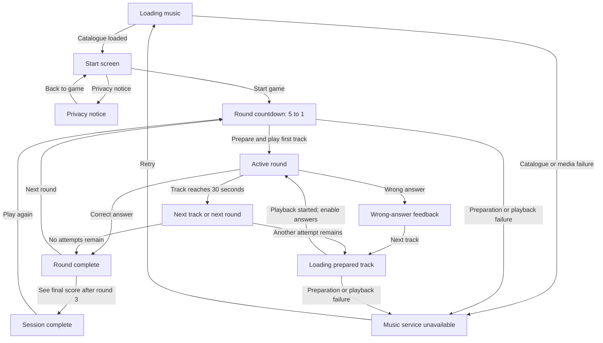

# Tango Track Guessing Game — Frontend

A client-side progressive web game for identifying tango orchestras from short audio previews.
The MVP starts with Carlos Di Sarli, Juan D'Arienzo, Anibal Troilo, Osvaldo Pugliese, and
Astor Piazzolla.

Run all commands below from this repository's root directory.

## Gameplay

- A session contains three rounds.
- Each round asks the player to identify one orchestra from three choices.
- The player can hear up to three different tracks from the same orchestra.
- A correct answer completes the round. Faster answers and earlier tracks award more points.
- A wrong answer deducts 50 points and requires the player to select **Next track** before
  the next prepared clip starts.
- A track that reaches 30 seconds can be skipped without a points penalty.
- After the third round, the session summary shows the final score and each round's score.

Correct-answer scoring decreases linearly while the clip plays:

| Track | Maximum | Minimum at 30 seconds |
|-------|---------|-----------------------|
| 1 | 300 | 100 |
| 2 | 200 | 75 |
| 3 | 100 | 50 |

## UI flow

The application does not use a client-side router. `src/app/App.tsx` owns the application
state and selects one screen at a time.



During `Loading prepared track`, all orchestra choices remain disabled. This prevents an
answer being recorded before the replacement track's `play()` promise has resolved.

## Local development

```bash
npm install
npm run dev
```

The application is a static React + Vite build with no backend. The game always fetches
`/catalogue/starter-catalogue.json` at runtime, but which catalogue that resolves to depends
on how you're running it:

- **`npm run dev`** (the Vite dev server) automatically serves the local synthetic
  **test catalogue** (see below) instead — no setup needed.
- **`npm run build`** / **`npm run preview`** (and any deployed build) always serve the real
  **archive.org catalogue** committed at `public/catalogue/starter-catalogue.json`.

## Commands

| Command | Purpose |
|---------|---------|
| `npm run dev` | Start the Vite development server with the synthetic test catalogue |
| `npm run build` | Type-check and create the production build in `dist/` |
| `npm run preview` | Serve the production build locally |
| `npm run build:catalogue` | Regenerate the production catalogue |
| `npm run build:sounds` | Regenerate feedback and countdown WAV files |
| `npm run test:unit` | Run pure game and audio unit tests |
| `npm run test:component` | Run React component tests |
| `npm run test:coverage` | Run the complete Vitest suite with coverage |
| `npm run test:e2e` | Run desktop and mobile Playwright smoke tests |

## Architecture

The frontend separates state orchestration, pure game rules, browser audio, and
presentational UI:

```text
src/
├── app/
│   └── App.tsx                 Application state and side-effect orchestration
├── game/
│   ├── audio/                  Track, countdown, and feedback audio players
│   ├── catalogue/              Runtime catalogue loading and validation
│   ├── engine/                 Pure session, selection, and scoring rules
│   └── types.ts                Shared game-domain types
├── telemetry/                  Anonymous analytics and error reporting
└── ui/
    ├── components/             Reusable score, choice, footer, and retry controls
    └── screens/                Presentational application screens
```

### State and game engine

`App.tsx` is the only stateful UI component. It loads the catalogue, creates sessions,
coordinates countdowns and audio, dispatches events to the game engine, and renders the
appropriate screen.

The modules under `src/game/engine/` are framework-free. `reduceSession` accepts the current
session and a game event, then returns a new session without mutating its input. This keeps
selection, scoring, and round progression independently testable.

### Track audio

`src/game/audio/player.ts` maintains two `HTMLAudioElement` instances:

1. The **active** element plays the current track and provides elapsed time for scoring.
2. The **standby** element prepares the following retry track while the active track plays.

At the start of a round, the first track loads during the countdown. After playback starts,
the next attempt begins buffering on the standby element. Selecting **Next track** waits for
that preparation, starts standby playback, and then promotes it to the active element.
Answer choices are enabled only after playback starts successfully.

Countdown and answer-feedback sounds use separate Web Audio players. Their failures are
non-fatal and do not interrupt the game.

### Catalogue

The catalogue is a runtime JSON asset rather than bundled application code.
`src/game/catalogue/catalogue.ts` validates its orchestra IDs, track IDs, preview URLs, and
required track coverage before a session can begin.

### Real catalogue (archive.org)

`public/catalogue/starter-catalogue.json` on disk is the production catalogue, generated
from a curated list of publicly hosted, individually addressable MP3 recordings on
[archive.org](https://archive.org) (three tracks per orchestra, 15 total), each confirmed to
be a single streamable file — not a multi-track ZIP — in the `opensource_audio`/`community`
collections. The source list, with the archive.org item identifier and filename for every
track, lives in `tools/build-catalogue/archive-org-tracks.ts`.

To add/replace tracks, edit that file and regenerate the catalogue:

```bash
npm run build:catalogue
```

This writes a fresh `public/catalogue/starter-catalogue.json` with `previewUrl`s pointing at
`https://archive.org/download/<identifier>/<filename>` (archive.org's stable, CORS-enabled
direct-download URL pattern) and a `version` of `archive-org-catalogue-<date>`.

### Local test catalogue (synthetic clips)

`public/catalogue/test-catalogue.json` is preserved for local styling and interaction
review only: it uses generated local speech clips in `public/audio/`, each announcing its
intended orchestra and track number, padded/looped to 30 seconds. Three clips are provided
per orchestra so the "Next track"/"Skip" controls can be exercised quickly without depending
on network access to archive.org. It is not music.

`vite.config.ts` includes a small dev-only middleware plugin that transparently serves this
file's contents for the `/catalogue/starter-catalogue.json` request whenever `npm run dev`
is running; this does not affect `npm run build`/`npm run preview`, and is never used by
automated tests (those load catalogue fixtures directly).

### Answer feedback sounds

Correct guesses play a short, polite confirmation chime; wrong guesses play a distinct,
gentle descending tone. Skipping a track does not play either cue. The sounds are generated
locally by `npm run build:sounds` and committed under `public/sounds/`, so they do not depend
on an external service.

There is intentionally no in-game mute or volume control. Use the device or browser's own
volume and silent-mode controls. If feedback audio is blocked or unavailable, gameplay and
visual feedback continue normally.

### Round countdown and track preparation

Every round starts with a large five-second countdown. A short pip accompanies each number
from 5 to 1, followed by a longer transition pip and a brief pause before the answer controls
appear. The countdown repeats before each new round, but not between retry tracks within the
same round.

The first track is prepared asynchronously while the countdown is visible. If preparation
finishes within those five seconds, playback begins immediately at the transition; on a
slower connection the round appears on time and playback starts as soon as the track becomes
ready. Once it starts, the following retry track is prepared in parallel without changing
or interrupting the active source. Current preparation or playback failures use the existing
service-unavailable screen, and abandoned countdowns cannot start stale audio.

All four local game cues are generated together:

```bash
npm run build:sounds
```

This regenerates the correct/incorrect feedback sounds and the short/final countdown pips
under `public/sounds/`.

## Deploying to GitHub Pages

`.github/workflows/deploy-pages.yml` builds this app and deploys `dist/` to GitHub Pages on
every push to `main` (and via manual `workflow_dispatch`). It sets `GITHUB_PAGES_BASE` to
`/<repo-name>/` for that build only, since a project site (as opposed to a
`<user>.github.io` user/org site) is served from a repo-name subpath — this rewrites all
built asset URLs and the runtime catalogue fetch path (`vite.config.ts`'s `base` option, read
by `loadCatalogue` via `import.meta.env.BASE_URL`) accordingly. Local dev/build/preview are
unaffected. One-time setup in the repo's GitHub settings: **Settings → Pages → Source →
GitHub Actions**.

## Validation

```bash
npm run build
npm run test:coverage
npm run test:e2e
```

Coverage must remain at least 80% for lines, functions, statements, and branches. The pure
game engine should remain at least 95% covered. archive.org recordings are used for their
open licensing; verify continued availability/licensing terms before any commercial
deployment.
